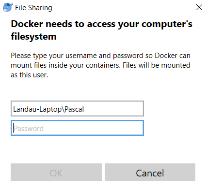
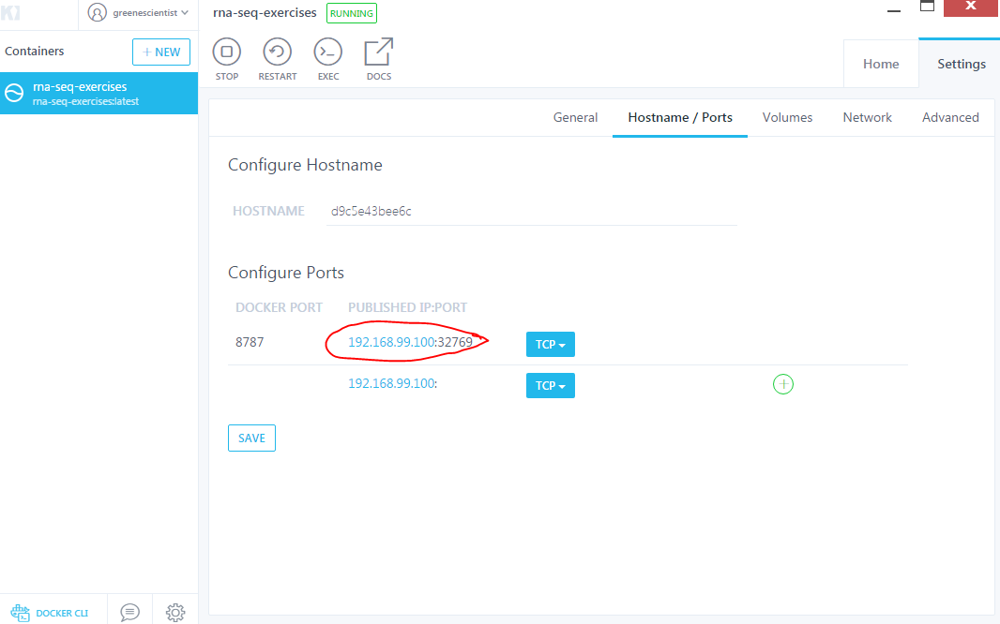

# CCDL RNA-Seq-Exercises

The [Childhood Cancer Data Lab](ccdatalab.org) is developing a series of short course modules to train researchers studying childhood cancer to perform reproducible analyses.

This module focuses on the analysis of RNA-seq data.
We structured this series to include one day on the analysis of a dataset selected by a course director, one day on the analysis of the participants own RNA-seq dataset, and a half-day to touch on some more advanced topics.
Here is the [schedule](schedule.md) for the workshop.

## Post-Docker Steps using Kitematic

1. Pull the appropriate image using command line.

- In *Mac*, search for and open `Terminal`.
- In *Windows*, search for and open `Command Prompt`.

  In your respective command line interface, copy and paste the following:
```
docker pull ccdl/training_rnaseq:2019-chicago
```

2. Run the container. Change the `<PASSWORD>` in the line below to whatever you'd
  like.
```
docker run -e PASSWORD=<PASSWORD> -p 8787:8787 ccdl/training_rnaseq:2019-chicago
```

3. Open `Kitematic` - you should see an image running.

4. `Settings` > `Volumes` > Set local folder to `training-modules` that was
transferred from the flash/hard drive, using the `CHANGE` button.


*For Windows*: After you set `Volumes` you will may see a message in the
lower right corner of your screen that asks if you would like to 'Share it'
with Docker.
Click the `Share it` button; it will ask for your credentials:  
  
Enter your password and click `OK`.

5. Navigate to RStudio window.

  - In a *Windows* or *Mac* in Kitematic, go to the `Settings` > `Hostname/Ports`
    tab and click on the blue lettering.


  - Alternatively, for a *Mac*, you can navigate to the RStudio window by typing
    `localhost:8787` in your web browser

6. Log into `RStudio`. The username will be 'rstudio' and the password will be
whatever you selected above (can also be accessed from the `Settings` >
`General` panel).

7. You should see a `kitematic/` folder in your `RStudio` Files panel. Click on it.
If you do not see the training modules folders in the kitematic folder, raise
your hand.

### If Kitematic doesn't work:

If all else fails and Kitematic is not working for you, go to your `Terminal` or
`Command Prompt` (for Mac or Windows respectively) and type in the following, but
replacing <PATH_TO_TRAINING_FOLDERS> bit with the absolute path to
"main directory" that was transferred from the flash/hard drive.
```
docker run -it --rm --mount type=volume,dst=/home/rstudio/kitematic,volume-driver=local,volume-opt=type=none,volume-opt=o=bind,volume-opt=device=<PATH_TO_TRAINING_FOLDERS> -e PASSWORD=<PASSWORD> -p 8787:8787 ccdl/training_rnaseq:2019-chicago
```
After starting your container this way, you can get to the RStudio window in
a similar way as described above:
- In Mac, type: `localhost:8787` in your web browser.
- In Windows, go to `Command Prompt`, type: `ipconfig` and click enter.
  Find the number that corresponds to the `Virtual Box Host Network` and the
  `IPv4 Address`. Copy and paste it.
  Put that number and `:8787` at the end of it in your browser.

Resume with step 6 and 7.
