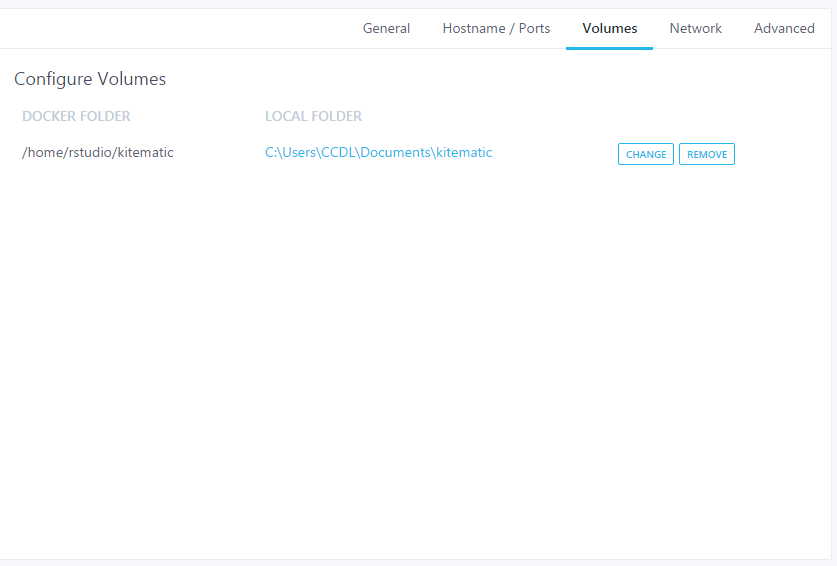
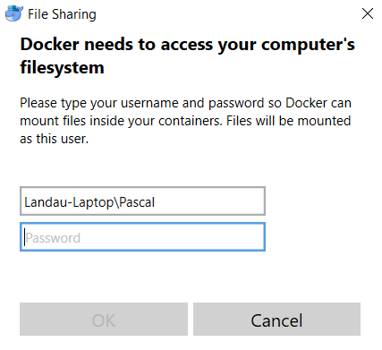
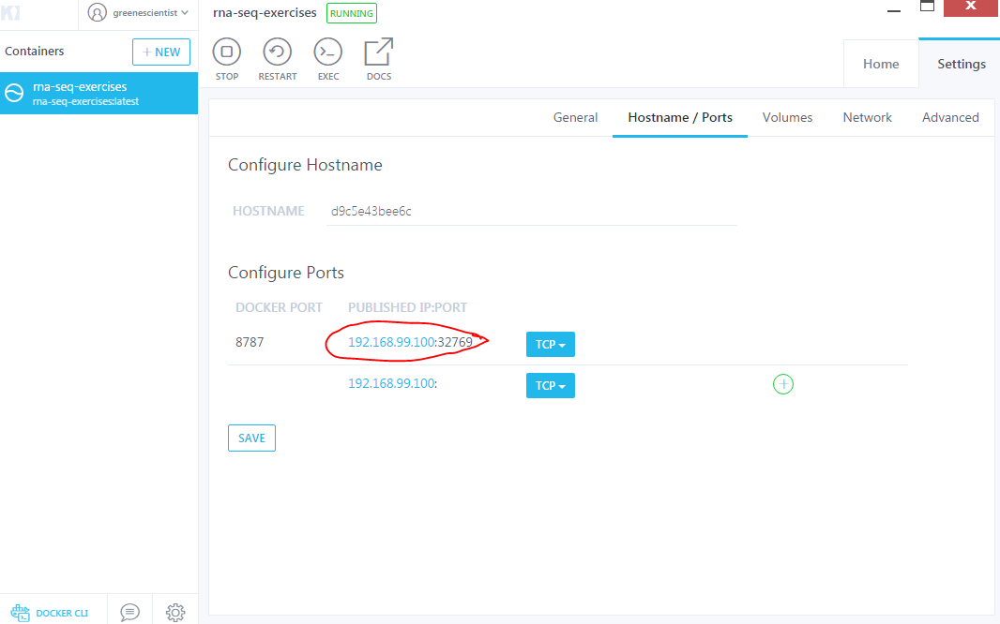
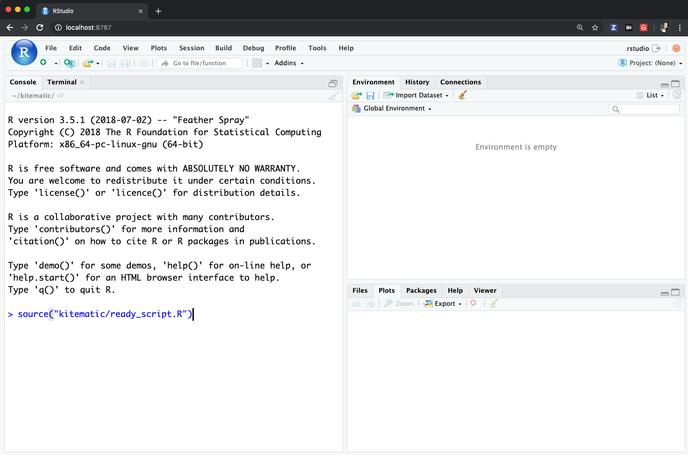

# Docker Container Set Up

The [Childhood Cancer Data Lab](ccdatalab.org) is developing a series of short course modules to train researchers studying childhood cancer to perform reproducible analyses.

This module focuses on the analysis of RNA-seq data. Here is the
[schedule](schedule.md) for the workshop.

After you have successfully installed [Docker](https://github.com/AlexsLemonade/training-modules/blob/master/docker-install/README.md), now you are ready to set up your Docker container. Working within this Docker container will provide you with all
the software and packages you need for this workshop. These instructions will
walk you through the set up of your Docker container.

## Part 1: Set up Docker image using a copy from the flash drives

1. Be sure that you have copied `ccdl_training_rnaseq.tar.gz` from the flash drive
as was instructed in [these steps](flashdrive-instructions.md). If you do not
have this file yet, follow [those instructions](flashdrive-instructions.md) before
attempting to complete these next steps.

### Next steps

* [Mac OS X and Linux](#mac-os-x-and-linux)
* [Windows 10 Pro](#windows-10-pro)

#### Next steps for Mac OS X and Linux users

2. Open `Terminal`. You can use Spotlight Search on a Mac to find this application.

3. You can navigate to your Desktop directory by copying and pasting this command into Terminal (hit Enter):

```
cd Desktop
```

4. Once you are in your Desktop directory, you must extract the file with the following command:

```
gunzip ccdl_training_rnaseq.tar.gz
```

5. You can then load the Docker image with `docker load`:

```
docker load -i ccdl_training_rnaseq.tar
```

This will take a minute.

6. When this step completes, check that it was successful with:

```
docker images
```

You should see output like:

```
REPOSITORY                         TAG                 IMAGE ID            CREATED             SIZE
ccdl/training_rnaseq               2019-czi        22f2b4f05051        3 days ago          5.28GB
```

_Note that the created field may not match._

#### Next steps Windows 10 Pro

Make sure you have 7-Zip installed.
If you do not, you can download the `64-bit x64` program here: https://www.7-zip.org/

2. Right-click `ccdl_training_rnaseq.tar.gz`.
3. Go to `7-Zip` and selected `Extract Here`.
When that has finished extraction, you should see `ccdl_training_rnaseq.tar` on your Desktop.

4. Open your `Command Prompt` application.
5. Navigate to your `Desktop` directory with:

```
cd Desktop
```
6. You can load the Docker image with `docker load`:

```
docker load -i ccdl_training_rnaseq.tar
```

This will take a minute.

7. When this step completes, check that it was successful with:

```
docker images
```

You should see output like:

```
REPOSITORY                         TAG                 IMAGE ID            CREATED             SIZE
ccdl/training_rnaseq               2019-czi        22f2b4f05051        3 days ago          5.28GB
```
_Note that the created field may not match._

## Part 2: Run the Docker container (all operating systems)

1. Run the container. Change the `<PASSWORD>` in the line below to whatever you'd
  like. Make sure to get rid of `<` and `>`. Also note that your chosen PASSWORD
  cannot have a `$`.
```
docker run -e PASSWORD=<PASSWORD> -p 8787:8787 ccdl/training_rnaseq:2019-czi
```

2. Open `Kitematic` - you should see an image running.

3. `Settings` > `Volumes` > Set local folder to `training-modules` that was
transferred from the flash/hard drive, using the `CHANGE` button.


*For Windows*: After you set `Volumes` you will may see a message in the
lower right corner of your screen that asks if you would like to 'Share it'
with Docker.
Click the `Share it` button; it will ask for your credentials:  
  
Enter your password and click `OK`.

4. Navigate to RStudio window.

  - In a *Windows* or *Mac* in Kitematic, go to the `Settings` > `Hostname/Ports`
    tab and click on the blue lettering.


  - Alternatively, for a *Mac*, you can navigate to the RStudio window by typing
    `localhost:8787` in your web browser

5. Log into `RStudio`. The username will be 'rstudio' and the password will be
whatever you selected above (can also be accessed from the `Settings` >
`General` panel).

6. You should see a `kitematic/` folder in your `RStudio` Files panel. Click on it.
If you do not see the training modules folders in the kitematic folder, raise
your hand.

7. To test that everything is set up, copy and paste the follow command in the
R Studio `Console` window.

```
source("kitematic/ready_script.R")
```



8. Click `Enter`. You should receive an indication that you are successfully set
up. Keep this indicator handy for the instructors and helpers as they come
around to check.

### If Kitematic doesn't work:

If all else fails and Kitematic is not working for you, go to your `Terminal` or
`Command Prompt` (for Mac or Windows respectively) and type in the following, but
replacing <PATH_TO_TRAINING_FOLDERS> bit with the absolute path to
"main directory" that was transferred from the flash/hard drive.
```
docker run -it --rm --mount type=volume,dst=/home/rstudio/kitematic,volume-driver=local,volume-opt=type=none,volume-opt=o=bind,volume-opt=device=<PATH_TO_TRAINING_FOLDERS> -e PASSWORD=<PASSWORD> -p 8787:8787 ccdl/training_rnaseq:2019-czi
```
After starting your container this way, you can get to the RStudio window in
a similar way as described above:
- In Mac, type: `localhost:8787` in your web browser.
- In Windows, go to `Command Prompt`, type: `ipconfig` and click enter.
  Find the number that corresponds to the `Virtual Box Host Network` and the
  `IPv4 Address`. Copy and paste it.
  Put that number and `:8787` at the end of it in your browser.

Resume with step 6 and 7.
