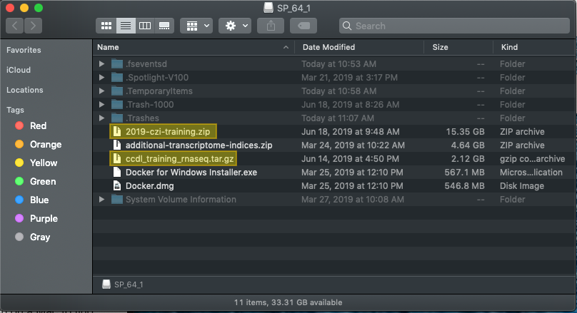

# Getting data from Flashdrives

Before starting these steps, you will want to be sure you have **50-60 GB** of free
space on your computer.

1. Copy `2019-czi-training.zip` and `ccdl_training_rnaseq.tar.gz` to a place where
you can easily find them, such as your Desktop.

2. Once you have copied these files, pass the flash drive off to the next person.

3. Extract the contents of the zip file `2019-czi-training.zip`. On most operating
systems you can double click the zip file, or right click and choose `Extract`.
Note: *after* this has *successfully* extracted, you can feel free to
delete the original `2019-czi-training.zip` if you would like.

4. `2019-czi-training/training-modules` is the main directory we will be using.

5. Now you can follow the Docker container set up instructions.
Use the instructions linked on the [schedule](schedule.md) for `Docker container set up`.
